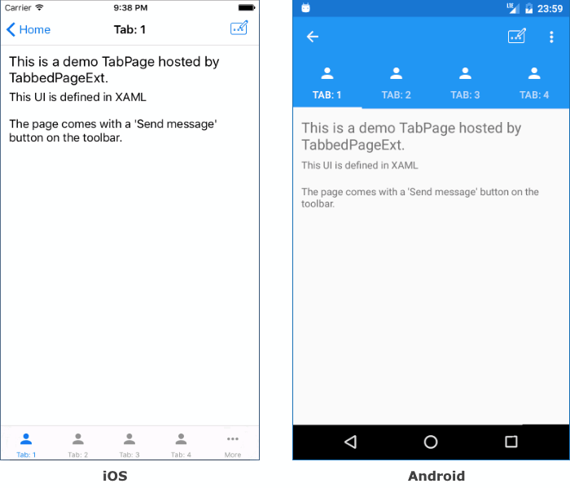

# CwwOnline.TabbedPageExt.Xamarin

[package version: 1.0.1 and higher]

A TabbedPage for Xamarin Forms which supports:
* **UI virtualization**: Tab pages can either directly be created (before they are selected) or they can be created at the moment the tab is selected.
* **Crossplatform 'More' view**: For all platforms (android, iOS, uwp, ..) a 'more' tabbar button (iOS) or toolbar button (android, uwp) is automatically inserted popping up an iOS-like "More" listview to select one of the 'hidden' pages.
As an option it also possible to configure the tabbed page to show a popup menu when touching the 'more' toolbar button (ios, android, uwp). The popup menu lists each overflow page with an icon and the page title.
* **Navigation support**: Possibility to push the TabbedPage itself on the navigation stack. 

Example view:

### Mode 1: 'More' page list (as in iOS)
"

### Mode 2: 'More' popup menu (as in android)
"

### Supported platforms
- iOS
- Android
- UWP

### Installation
The plugin is available on NuGet:  [https://www.nuget.org/packages/CwwOnline.TabbedPageExt.Xamarin/](https://www.nuget.org/packages/CwwOnline.TabbedPageExt.Xamarin/).
Install the plugin into your PCL project and in your iOS and Android client projects.
If you also target UWP then you have to manually copy 2 files in the UWP project:
- tabbedpageext_more_vert_black.png, and
- tabbedpageext_more_vert_white.png
You can find various resolutions of these files in the plugin's Android "resources/drawable" folders [here](TabbedPageExt/TabbedPageExt.Android/Resources);

If you want to have a popup menu when pressing 'More' then you must also install the Rg.Plugins.Popup package. This plugin is also available on NuGet: [https://www.nuget.org/packages/Rg.Plugins.Popup](https://www.nuget.org/packages/Rg.Plugins.Popup).
It extends the footprint of your app somewhat but it is an easy to use tool in your project in case you are looking for flexible and customizable popups.

### Usage
**TabbedPageExt** extends the **TabbedPage** class of xamarin.forms in a couple of ways:
- The child pages that you want to add to the class are instantiated at the moment when the user selects them.
- On Android and UWP **TabbedPageExt** also supports the concept of and 'overflow' page in a similar way as in iOS. The only difference is that the 'More' icon/button is on the top toolbar. Pressing the button shows a full page with a listview from where a page can be opened.
**TabbedPageExt** creates itself the 'overflow' list page (also on iOS). This has the advantage that on all platforms the page (when opened) always appears on the top of the app; also when the tabbed page itself is pushed on the navigation stack.
- On all platforms (i.e. also on iOS, if you want) **TabbedPageExt** can also be told to show the overflow pages in a popup menu.
- The overflow breakpoint is configurable.

#### Creating and populating a TabbedPageExt page

The following example shows how to create a **TabbedPageExt** page and populate it with a number of child pages.
```csharp
public class MyTabbedPage: TabbedPageExt.TabbedPageExt
{
  public MyTabbedPage()
      : base(Device.RuntimePlatform == Device.Android ? IconColor.White : IconColor.Black)
   {
      MorePageTitle = "Meer";
      var tabPage1 = new TabPage(
         "Tab1",
         "tab1_icon_white.png", "tab1_icon_black.png",
         typeof(ContentPage1),
         new ContentPage1ViewModel());
      this.TabPages.Add(tabPage1);
      
      var tabPage2 = new TabPage(
         "Tab2",
         "tab2_icon_white.png", "tab2_icon_black.png",
         () =>
         {
            return (ContentPage2)Activator.CreateInstance(typeof(ContentPage2), new ContentPage2ViewModel());
         });
      this.TabPages.Add(tabPage2);
      
      var tabPage3 = new TabPage(
         "Tab3",
         "tab2_icon_white.png", "tab2_icon_black.png",
         () =>
         {
            return (ContentPage2)Activator.CreateInstance(typeof(ContentPage2), new ContentPage2ViewModel());
         });
      this.TabPages.Add(tabPage2);
      
   }
}
```
**TabbedPageExt** expects an **IconColor* enum value in its constructor which defines whether the 'More' icon in the app's toolbar must be black or white. The icon itself is defined in the plugin's assembly.

Property **MorePageTitle** let's you change the 'More' icon title from the default ("More") to whatever language you want, like: "Meer" (dutch). 

The page is populated with a number of child pages by creating a **TabPage** for each of them:
- The title of the first page is "Tab1"; the page icon is "tab1_icon_white.png"; the icon used in the 'more' page list or popupmenu is "tab1_icon_black.png"; the actual content of the page comes from MyContentPage (and MyContentPageViewModel) which is created when the page is selected.
MyContentPage is typically a normal xamarin.forms **ContentPage**. **TabPage** is instructed to instantiate this page by passing the page Type and an optional viewmodel object. When present, the viewmodel will be given as parameter to the page constructor.
- The 2nd page is defined by passing a Func<> delegate to **TabPage** to create the **ContentPage** when the page is opened.
- Other pages can then be added by using any of the above 2 methods.

The 2nd method has the advantage that you have the freedom to create the the ContentPage's viewmodel at the moment the page is opened. If you opt to create view models using some kind of factory concept or dependency injection then of course method 1 works equally well.

Note: Creating and populating a **TabbedPageExt** page using XAML is not supported. 

#### Set overflow threshold
The overflow threshold (default = 4) can be set by assigning a value to property **MaxTabs** of **TabbedPageExt**. You must set the value before adding child pages. An example:
```csharp
public MyTabbedPage()
      : base(Device.RuntimePlatform == Device.Android ? IconColor.White : IconColor.Black)
   {
      MaxTabs = Device.RuntimePlatform == Device.iOS ? 4 : 5;
      
      // Add TabPages
      ...
   }
```
Note: On iOS you should never set the threshold higher than what is defined in the platform since iOS will automatically introduce a 'More' tab when you overflow the limit.


#### More page list or popup menu
As per default **TabbedPageExt** is configured to show an iOS-like page overflow selection list when tapping the 'more' button.
To change the mode to show a popup menu you must set the property **MorePageMode** to **MorePagesAccessMode.MorePopupMenu**. You must set the value before adding child pages. An example:
```csharp
public MyTabbedPage()
      : base(Device.RuntimePlatform == Device.Android ? IconColor.White : IconColor.Black)
   {
      MaxTabs = (Device.RuntimePlatform == Device.iOS) ? 4 : 5;
      MorePageMode = MorePagesAccessMode.MorePopupMenu;
      
      // Add TabPages
      ...
   }
```


### API description

#### TabbedPageExt properties

<table>
   <tr>
      <td valign="top"><strong>MorePageTitle</strong></td>
      <td>A string for the "More" text presented on the More tab (iOS) or the More toolbar icon (other platforms).</td>
   </tr>
   <tr>
      <td valign="top"><strong>MorePagesMode</strong></td>
      <td>The maximum number of tabs to be shown on the TabbedPage. Default = 4.</td>
   </tr>
   <tr>
      <td valign="top"><strong>MaxTabs</strong></td>
      <td>Defines how overflow pages (i.e. those exceeding MaxTabs while adding them) are made accessible. Set to enum value MorePagesAccessMode.MorePage (default) or  MorePagesAccessMode.MorePopupMenu.</td>
   </tr>
   <tr>
      <td valign="top"><strong>DontMovePages</strong></td>
      <td>Set this property to True when you don't want the first hidden tab page to be shown in case a visible page is removed. Default = False.</td>
   </tr>
   <tr>
      <td valign="top"><strong>MoreToolbarIcon</strong></td>
      <td>Icon string for the More toolbar icon. When set it overrides the default icon provided by the plugin.</td>
   </tr>
   <tr>
      <td valign="top"><strong>MorePopupMenuMargin</strong></td>
      <td>A xamarin.forms Thickness definition which you can set to override the default margin of the popup menu. Note that the margin aligns the menu on the top right side of the screen. That cannot be changed.
      </td>
   </tr>

</table>

#### TabPage class
Still to do...
